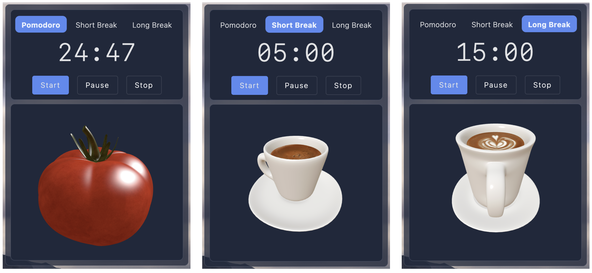

# Pomodoro tracker with WebGL animation

This project represents a tray application that helps to follow
[Pomodoro][pomodoro-wiki] time management technique. The application 
is implemented using [WebGL][webgl-mdn] and [JxBrowser][jxbrowser].



[pomodoro-wiki]: https://en.wikipedia.org/wiki/Pomodoro_Technique
[webgl-mdn]: https://developer.mozilla.org/en-US/docs/Web/API/WebGL_API
[jxbrowser]: https://www.teamdev.com/jxbrowser

## Summary

### Problem

Bringing 3D animation into a desktop application can be challenging.
Integrating sophisticated 3D animation frameworks and libraries into existing
applications often requires significant efforts. Moreover, ensuring cross-platform
compatibility adds another layer of complexity, as different operating systems 
may have varying levels of support for 3D rendering technologies.

### Solution

JxBrowser supports WebGL, allowing rendering of 3D graphics within Java application.
It integrates the Chromium engine, which inherently supports WebGL, ensuring 
compatibility and performance. One can use JxBrowser's API to embed 3D content 
and complex visualizations in their applications. This support enables a broad 
range of use cases, from 3D data visualizations to medical applications.

This project demonstrates capability of 3D rendering with JxBrowser featuring
three timers from a well-known Pomodoro technique, which are accompanied by
the corresponding rotating 3D models. Here are some highlights:

1. Cross-platform support for Windows, macOS, and Linux,
   with various architectures, too.
2. WebGL leverages the power of the GPU to accelerate rendering processes.
3. There is a rich ecosystem of libraries and frameworks built on top of WebG.
This projects uses [ThreeJs][three-js] to load and animate the models.

[three-js]: https://github.com/mrdoob/three.js

## Project structure

The project consist of a single Gradle module, but it has two logical parts:

1. Compose application (written in Kotlin), which uses JxBrowser.
2. `webgl` component, containing JavaScript code that loads and animates 
the used models.

During the build, `webgl` component is assembled and put into the resources folder
of Compose application. In runtime, JxBrowser loads the assembled JS files from
the app's resources.

## Requirements

- Java 17 or later.
- Node.js 16 or later.

## Running

To run the application, execute the following command:

```bash
./gradlew :compose:pomodoro:run
```
