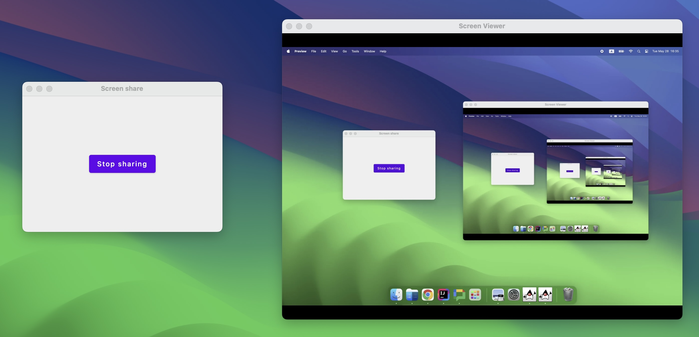

# Java remote screen sharing via WebRTC

This project demonstrates how to share a screen between two Java 
applications using [WebRTC][webrtc] and [JxBrowser](jxbrowser).

[webrtc]: https://webrtc.org/
[jxbrowser]: https://www.teamdev.com/jxbrowser


## Summary

### Problem

Screen sharing is an essential tool used in many applications and services.
While there are many existing services on the market, it is often needed
to add this feature into an existing application, closely integrating with 
other parts of the application, and addressing potential privacy concerns.

Building screen sharing from scratch in a desktop app can be resource-intensive. 
One has to handle complex network protocols, optimize the user interface 
to stream video, and also, maintain this code for years to come.

### Solution

JxBrowser supports the data transfer over WebRTC. It is an open standard,
with many possible applications, one of them being video streaming.
With WebRTC, video, audio, and other types of data are transferred
peer-to-peer between application instances.

Java as a platform has no built-in WebRTC support, but as JxBrowser operates
on top of Chromium engine, its API provides all WebRTC features available 
in Chrome. Not only it is possible to build a screen sharing channel between 
two apps using JxBrowser, but one can have any WebRTC-compatible software 
to send or receive data streams.

This project is a simple desktop app built with JxBrowser and WebRTC, 
with the code anyone can re-use in their own projects. Here is a number 
of highlights:

1. Cross-platform support for Windows, macOS, and Linux, 
with various architectures, too.
2. WebRTC implementation comes from Chromium, which is constantly updated 
with performance improvements and security fixes.
3. Following an open standard makes it easy to integrate with other platforms,
such as mobile.
4. All media streams are end-to-end encrypted, keeping the screen-sharing 
sessions secure and private.

## Project structure

The project consists of four modules:

1. `server` establishes direct media connections between peers.
2. `sender` is a Compose app that shares the primary screen.
3. `receiver` is a Compose app that shows the shared screen.
4. `common` holds a common code shared among Compose apps.

The [server][signaling-server] itself and Compose apps use PeerJs library, 
which provides an easy-to-use API for working with WebRTC. The library consists
of the [client][peer-js] and [server][peer-js-server] parts accordingly.

[signaling-server]: https://developer.mozilla.org/en-US/docs/Web/API/WebRTC_API/Signaling_and_video_calling#the_signaling_server
[peer-js]: https://github.com/peers/peerjs
[peer-js-server]: https://github.com/peers/peerjs-server

## Requirements

- Java 17 or later.
- Node.js 16 or later.

## Running

To run this example, one needs to start the server, sender, and receiver apps
in individual terminals.

By default, the example uses `3000` port. However, it is possible to pass
a custom port with CLI options. Ensure that you pass the same port to each task.

Start the signaling server:

```bash
./gradlew :compose:screen-share:server:run [--port=4000]
```

Start the sender app:

```bash
./gradlew :compose:screen-share:sender:run [-Pport=4000]
```

Start the receiver app:

```bash
./gradlew :compose:screen-share:receiver:run [-Pport=4000]
```
