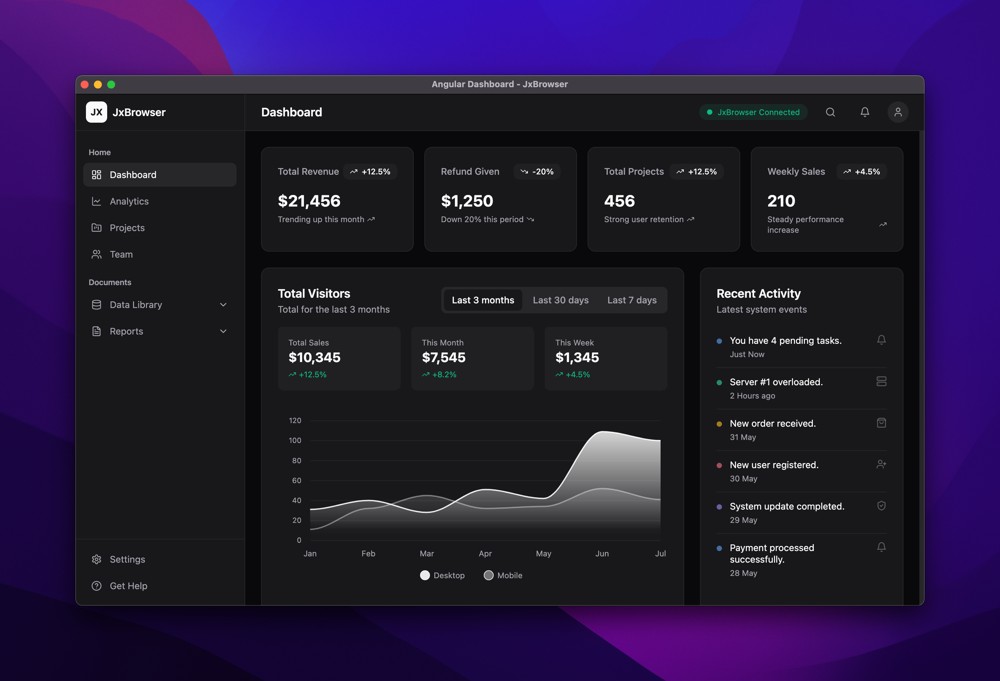

# Desktop Angular Dashboard with JxBrowser

This project demonstrates how to create a cross-platform desktop application with a Java backend and a modern web frontend using [Angular UI](https://angular.dev/) with [Tailwind CSS](https://tailwindcss.com/).

The application represents a dashboard that displays various metrics, charts, and activity feeds. Here's how the dashboard looks like:



## Prerequisites

- Java 17 or higher.
- [Node.js](https://nodejs.org/en/download) 22.0 or higher.
- [WiX Toolset](https://github.com/wixtoolset/wix3/releases/tag/wix3141rtm) 3.14.1 or higher if you are planning to package an installer on Windows.

## Running the application

To run the application in the development mode, you first need to start the Angular dev server with enabled **Hot-Module Reload (HMR)**:

```bash
# Terminal 1: Start Angular dev server
./gradlew :desktop-angular-dashboard:startDevServer
```

Then open another **Terminal** window and run the following command to start the Java application:

```bash
# Terminal 2: Run Java application
./gradlew :desktop-angular-dashboard:run
```

## Packaging

To build native installers for macOS and Windows, use the following commands.

To build macOS DMG run:

```bash
./gradlew :desktop-angular-dashboard:clean :desktop-angular-dashboard:packageDmg
```

To build Windows EXE installer run:

```bash
gradlew.bat :desktop-angular-dashboard:clean :desktop-angular-dashboard:packageExe
```

## About the project

### Problem

Nowadays, developing and supporting desktop applications based on traditional solutions like Swing/JavaFX/SWT can be challenging. They become extremely hard to scale and maintain due to lack of experienced developers in this area. That is why an increasing number of old legacy applications switch to web-based UI to eliminate everyday maintenance challenges and improve scalability and user experience. With millions of developers experienced in JavaScript, TypeScript, and frameworks like Angular, React and Vue, finding talent and speeding up development is much easier.

The modern web browsers like Chromium make this transition toward web-based UIs easier. Chromium allows rendering web content seamlessly, and supports the latest HTML and CSS standards, ensuring compatibility with modern UI frameworks.

### Solution

JxBrowser allows embedding a Chromium-based browser into Java desktop applications. It allows developers to create cross-platform desktop apps that combine the power of Java platform and the flexibility of web technologies.

Communication between Java backend and Angular frontend is implemented using JxBrowser's JavaScript-Java Bridge.

