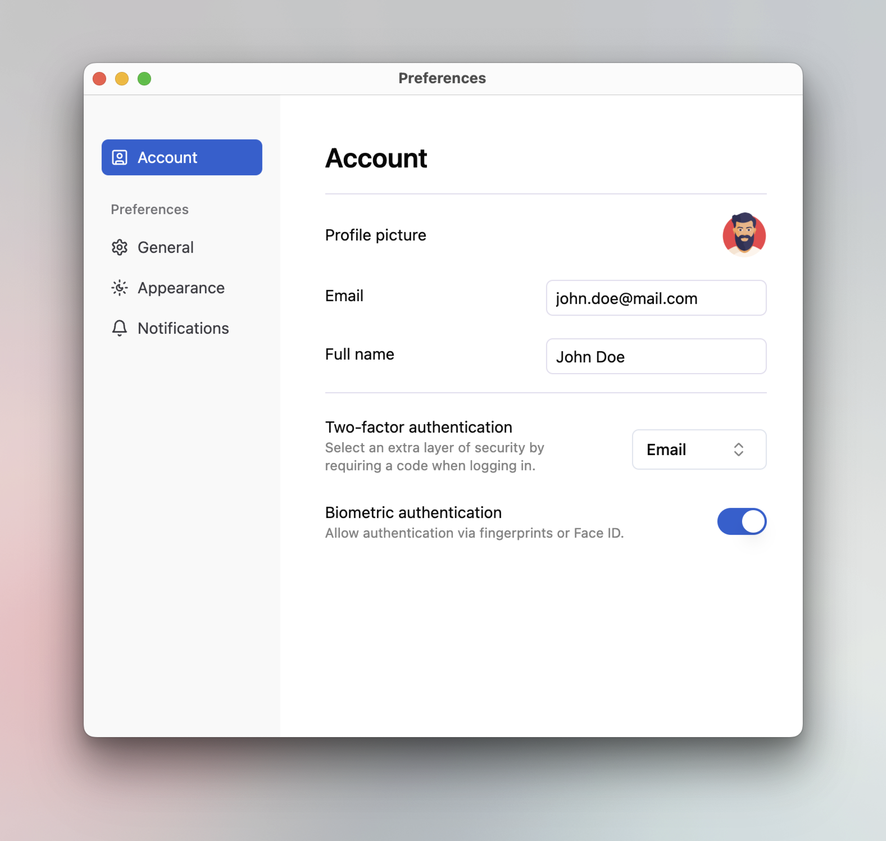

# Desktop web apps with JxBrowser

This project demonstrates how to use JxBrowser with modern web UI frameworks such
as [shadcn/ui](https://ui.shadcn.com/) to create desktop applications with Java backend and
TypeScript/React/Shadcn frontend.



## Summary

### Problem

Nowadays, developing and supporting desktop applications based on traditional solutions like
Swing/JavaFX/SWT can be challenging. They become extremely hard to scale and maintain due to 
lack of experienced developers in this area. That is why an increasing number of old legacy 
applications switch to web-based UI to eliminate everyday maintenance challenges and improve 
scalability and user experience. With millions of developers experienced in JavaScript, TypeScript,
and frameworks like React, finding talent and speeding up development is much easier.

Using modern browsers like Chromium makes this transition toward web-based UIs easier. This browser
allows to render web content seamlessly, and support the latest HTML/CSS/JavaScript, ensuring 
compatibility with modern UI frameworks. These frameworks use advanced CSS, responsive design,
and rich component libraries.

#### Solution

This example demonstrates how to create a desktop application that uses a modern Shadcn framework
for building UI. The showcased application is a web server that utilizes the JxBrowser API
to render web UI from the [web-app](/web-app) directory. 

Rendering web UI is different depending on the mode, production or development.

In the development mode, you can start a local Vite server that will host the web application.

However, the Vite server isn't designed for production use. In this case, we will need an
approach based on intercepting URL requests and registering a custom scheme for loading web UI
resources.

Communication between Java and UI is implemented using Protobuf and gRPC. These technologies provide
an effective solution, enabling fast and reliable communication with a well-structured 
approach to data exchange.

To sum up, here is a short list of benefits:

1. Full automation of rendering.
2. Advanced CSS, responsive design, and rich library of pre-designed components.
3. Web technologies' modular design makes it easy to update, scale, and improve 
the UI as needs change.

## Description

The project is a desktop application that uses web UI on Shadcn to display regular 
application preferences.

## Prerequisites

- Java 17 or higher.
- [Node.js](https://nodejs.org/en/download) 20.11.0 or higher.
- [WiX Toolset](https://github.com/wixtoolset/wix3/releases/tag/wix3141rtm) 3.14.1 or higher if you are planning to package an installer on Windows.

## Running the application

To run the application in the development mode, you first need to start Vite development server with Hot-Module Reload (HMR):

```bash
./gradlew desktop-web-app:startDevServer
```

Then open another terminal and run the following command to start the application:

```bash
./gradlew desktop-web-app:run
```

## Packaging

To build a native installer for macOS or Windows, use the following commands.

### macOS (DMG)

```bash
./gradlew desktop-web-app:clean desktop-web-app:packageDmg
```

### Windows (EXE)

```bash
gradlew.bat desktop-web-app:clean desktop-web-app:packageExe
```

## Protobuf

This app uses Protobuf for communication between Java and JavaScript. The Protobuf files are
located in the `proto` directory. Java and JavaScript code for Protobuf messages is generated automatically during the build process. To generate proto messages manually, run the following command:

```bash
./gradlew desktop-web-app:generateProto
```
