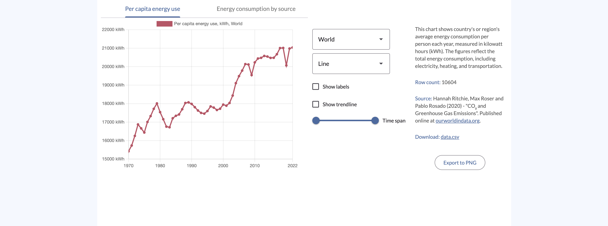

# Server-Side Chart Rendering with JxBrowser

This project demonstrates how to render and export HTML/CSS/JS charts 
on the server side using JxBrowser.



### Summary

#### Problem

Business people often want to automate their reporting. The resulting files
may include a variety of data, including charts over different slices of the app's domain.
In terms of development, it is pretty costly to implement and support such a chart rendering
on the server-side, in the JVM world.

At the same time, the modern HTML/CSS/JS tech stack provides a lot of means to build any charts.
Being executed in a browser, such a code renders the charts the same for every end-user.
It would be nice to use this approach on a JVM server/desktop application and write an automated
solution to export images with no need for human actions, such as making screenshots.

#### Solution

This example demonstrates how to tackle these challenges with JxBrowser.
The showcased application is a web server that utilizes the JxBrowser API
to render an arbitrary web page, and then export it to an image. The resulting images
are exactly the same as if they are rendered by a plain desktop Chromium browser.

With such an approach, the application renders the HTML/CSS/JS charts directly on the server side,
upon a programmatic request. Once built and run, this solution requires no human interaction or intervention.
It can be hosted on a dedicated server or a Cloud VM, rendering and sharing charts
upon requests, such as a cron job or a REST API call from another program.

To sum up, here is a short list of benefits:

1. Full automation of rendering.
2. Ability to use anything the web world provides, including excellent libraries
   like [Chart.js][chart.js], [Bootstrap][bootstrap] or [Material][material] typography,
   with a Java/Kotlin application.
3. Re-use the same chart-drawing code on the web server and the web client, 
   e.g., to generate a preview. The outcome is identical.

### Description

The project is a web application that hosts [Chart.js][chart.js] charts visualizing data 
for a couple of different datasets. The charts are initially rendered on the client side 
where they can be tweaked and sent to the server for server-side rendering. The server side 
runs the client-side JS in a headless JxBrowser instance to render the charts and export 
them to PNG format.

#### Client side

The client side of the application is a simple web page that displays the dataset 
information and provides the necessary controls for tweaking and exporting the charts. 
The client side is implemented in JavaScript and uses the [Chart.js][chart.js] library 
to render the charts. The app is styled with [Material 3][material] components.

#### Server side

The server side of the application is a [Micronaut][micronaut] web server that 
uses the JxBrowser library to render charts as images on the server side. Using 
the client-side chart-drawing code, the server generates a widget that represents 
a rendered chart and exports it to PNG format with the help of JxBrowser:
```java
browser.navigation()
       .loadUrlAndWait("generated-widget.html");
       
var image = browser.bitmap();       
```
The image is then returned to the client side as a byte array.

### Prerequisites

1. [Java 17+][java].
2. [NPM][npm].

This project uses [Gradle][gradle] as a build system. The [Gradle Wrapper][gradle-wrapper]
is included in the project, so there is no need to install Gradle separately.

### Running locally

```shell
   ./gradlew build
   ./gradlew :web-server:chart-rendering:server:run
```
After this, open `/server/chart-rendering/client/app/index.html` to launch 
the client side of the application.

The exported files are available for download in the browser and also appear 
under the `{project root}/web-server/chart-rendering/server/images` directory 
on the local file system.

[chart.js]: https://www.chartjs.org/
[bootstrap]: https://getbootstrap.com/
[material]: https://m3.material.io/
[micronaut]: https://micronaut.io/
[java]: https://www.azul.com/downloads/#zulu
[npm]: https://nodejs.org/en/download
[gradle]: https://gradle.org
[gradle-wrapper]: https://docs.gradle.org/current/userguide/gradle_wrapper.html
