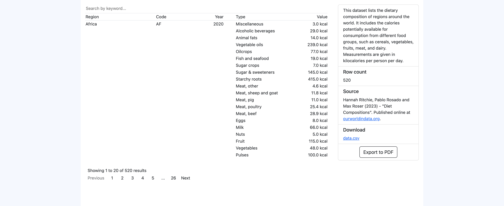

# PDF export with JxBrowser

This project demonstrates how to perform programmatic PDF export of HTML/CSS/JS content
with the help of JxBrowser.



### Summary

#### Problem

When an organization wants to assemble and share some information, by far, 
the most common format for such reports would be PDF. The resulting files may 
contain a variety of data, including tables, charts, and other visualizations. 

However, while the format is very popular, setting up an automated PDF generation system 
can often impose challenges. Depending on the solution, the organization may be required 
to lock into a specific reporting tool and/or the developers may need to use a program library 
with a steep learning curve requiring proficiency to use effectively. Also, the fidelity 
of the generated content may not be as high as expected.

In many situations, it's preferable to use an alternative approach: render the content 
as HTML and print it to PDF via the built-in printing mechanism of a web browser.

#### Solution

In this example, we use JxBrowser on a JVM web server to export table-like data
to PDF upon request. As JxBrowser is built on top of Chromium, we use the HTML
capabilities to create the table interface, and use CSS and JS libraries to establish
a proper look&feel. At runtime, the page is filled with the actual data, and rendered
to PDF via JxBrowser's API. The resulting PDFs are the same as if they were printed
by the Chromium browser for the desktop.

Another thing is that once the app is launched, the PDF export process requires
no human intervention or any other interaction with the UI. This helps to run,
say, scheduled reports every night, if needed.

The app can be hosted on a dedicated server or a Cloud VM, generating PDFs upon 
requests, such as a cron job, or a REST API request from another program.

To sum up, here is a short list of benefits:

1. Fully automated PDF generation.
2. Independence from the third-party report formats and specific reporting tools, 
   high quality of the generated content.
3. Reusing the same HTML/CSS/JS code for the PDF generation and on the web
   client if necessary, e.g. to generate a preview. The outcome is identical.

### Description

The main components of this application are:

1. A JxBrowser instance, which can print an arbitrary webpage to PDF programmatically.
   How to do it is shown in `PdfPrinting.kt`. This particular example highlights
   the usage of the JxBrowser Kotlin API but the identical process can be executed
   using the JxBrowser Java API.

   Also, the printing process is adapted to the pages that require long asynchronous
   operations to finish before being printed. If such operations are absent, the printing
   process can be simplified to a single call of `browser.mainFrame!!.print()`
   (see `PdfPrinting.kt`).

2. A web server that accepts print requests and generates PDF files using JxBrowser.
   A print request encloses the specifics of the tabular data to be printed. Based
   on these parameters, the server generates an HTML/CSS/JS table by running
   `browser.executeJavaScript(...)` after loading some generic HTML template.

   An alternative approach would be to generate an HTML template with all the
   necessary parameters beforehand and then load it into the browser directly.
   Both approaches are valid and lead to the same result.

3. A client side that allows tweaking the table and sending it to the server for PDF export.
   The displayed table data can be changed via the designated filter controls.

The technology stack used in this project is [JxBrowser 8][jxbrowser], [Ktor][ktor]
as a web server, and [Grid.js][gridjs] for the HTML/CSS/JS table rendering.

### Prerequisites

- Java 17 or later.
- [NPM][npm].

This app uses [Gradle][gradle] as a build system. The [Gradle Wrapper][gradle-wrapper]
is already included in the root Gradle project.

### Running locally

To start the application, execute the following command
from the Gallery's root folder:

```shell
   ./gradlew :web-server:pdf-export:server:run
```

After this, open the `<project root>/web-server/pdf-export/client/app/index.html` 
file in a browser to access the client side of the application.

The exported files are available for download in the browser and also appear
under the `<project root>/web-server/pdf-export/server/exported` directory
on the local file system.

[jxbrowser]: https://teamdev.com/jxbrowser
[ktor]: https://ktor.io
[gridjs]: https://gridjs.io
[npm]: https://nodejs.org/en/download
[gradle]: https://gradle.org
[gradle-wrapper]: https://docs.gradle.org/current/userguide/gradle_wrapper.html
